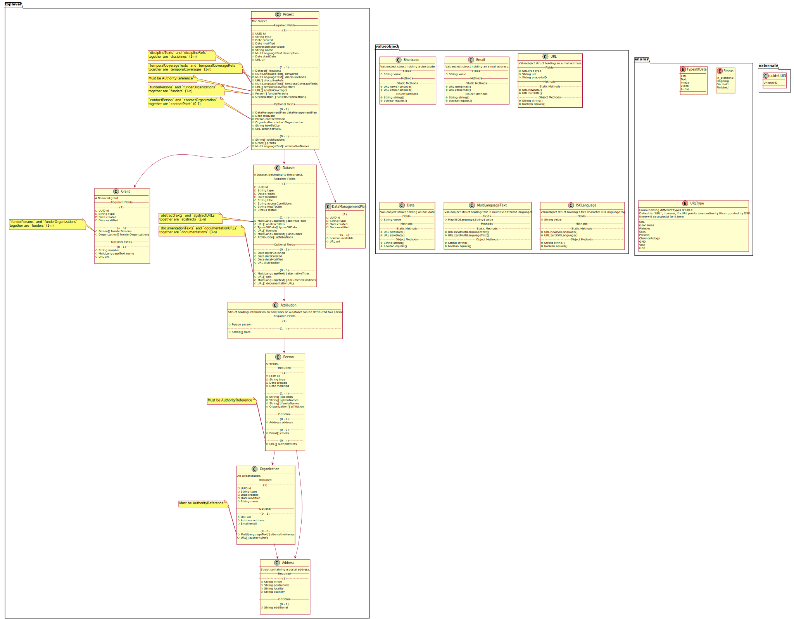
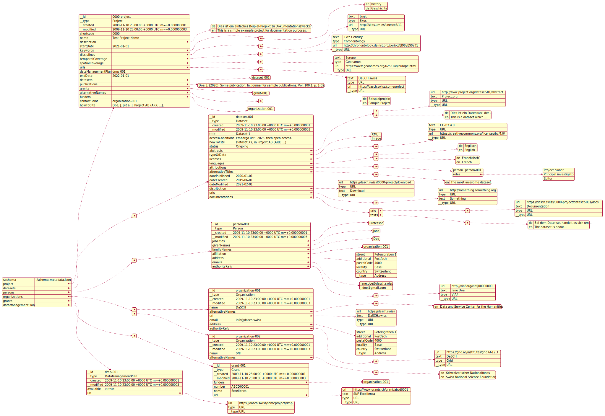

# Metadata


## Resource Classes

| General              | Domain Model       | JSON API | RDF Mapping  | SWISSUbase mapping   |
| -------------------- | ------------------ | -------- | ------------ | -------------------- |
| Project              | Project            | object   | :Project     | StudyVersion (300)   |
| Dataset              | Dataset            | object   | :Dataset     | DatasetVersion (400) |
| Person               | Person             | object   | <!-- XXX --> | <!-- XXX -->         |
| Organization         | Organization       | object   | <!-- XXX --> | <!-- XXX -->         |
| Address              | Address            | object   | <!-- XXX --> | <!-- XXX -->         |
| Grant                | Grant              | object   | <!-- XXX --> | <!-- XXX -->         |
| Data Management Plan | DataManagementPlan | object   | <!-- XXX --> | <!-- XXX -->         |


## Properties on Resource Classes

### Project

| Class                | Note                                                           | Cardinality                                 | Domain Model                                       | Domain Model Type             | JSON API             | JSON Type                             | RDF Mapping                           | RDF type                     | RDF Cardinality | SWISSUbase mapping                                                      |
| -------------------- | -------------------------------------------------------------- | ------------------------------------------- | -------------------------------------------------- | ----------------------------- | -------------------- | ------------------------------------- | ------------------------------------- | ---------------------------- | --------------- | ----------------------------------------------------------------------- |
| ID                   | internal ID                                                    | 1                                           | `id`                                               | UUID                          | `__id`               | string                                | IRI                                   | IRI                          | -               | -                                                                       |
| type                 | internal type                                                  | 1                                           | `type`                                             | String                        | `__type`             | string                                | `@type` / `rdf:type`                  | rdf:type                     | -               | -                                                                       |
| date created         | internal creation date                                         | 1                                           | `created`                                          | Date                          | `__created`          | string                                | <!-- XXX -->                          | <!-- XXX -->                 | -               | -                                                                       |
| date modified        | internal modification date                                     | 1                                           | `modified`                                         | Date                          | `__modified`         | string                                | <!-- XXX -->                          | <!-- XXX -->                 | -               | -                                                                       |
| (†) short code       | deprecated internal short code                                 | 1                                           | `shortcode`                                        | Shortcode                     | `shortcode`          | string                                | `:hasShortcode`                       | xsd:string                   | 1               | ?                                                                       |
| name                 | project name                                                   | 1                                           | `name`                                             | String                        | `name`               | string                                | `:hasName`                            | xsd:string                   | 1               | Title (302)                                                             |
| description          | project description                                            | 1                                           | `description`                                      | MultiLanguageText             | `description`        | object (multi-language text)          | `:hasDescription`                     | xsd:string (with `@en` etc.) | 1-n             | Abstract (314)                                                          |
| start date           | start date of the project                                      | 1                                           | `startDate`                                        | Date                          | `startDate`          | string (`YYYY-MM-DD`)                 | `:hasStartDate`                       | xsd:date                     | 1               | Start date (308)                                                        |
| datasets             | references to all datasets that are part of the project        | 1-n                                         | `datasets`                                         | Dataset[]                     | `datasets`           | array of string (ID)                  | - <!-- TODO: add? or leave as is? --> | -                            | 1-n             | <!-- TODO: note: they link it in dataset (400.1) -->                    |
| keywords             | keywords describing the project                                | 1-n                                         | `keywords`                                         | MultiLanguageText[]           | `keywords`           | array of object (multi-language text) | `:hasKeywords`                        | xsd:string                   | 1-n             | ?                                                                       |
| disciplines          | discipline of research the project belongs to                  | 1-n                                         | `disciplineTexts` and `disciplineRefs`             | MultiLanguageText[] and URL[] | `disciplines`        | array of object (`URL`)               | `:hasDiscipline`                      | schema:URL or xsd.string     | 1-n             | ? <!-- TODO: ideally create our own skos on basis of SNF vocabulary --> |
| temporal coverage    | time period covered by the project                             | 1-n                                         | `temporalCoverageTexts` and `temporalCoverageRefs` | MultiLanguageText[] and URL[] | `temporalCoverage`   | array of object (`URL`)               | `:hasTemporalCoverage`                | schema:URL or xsd.string     | 1-n             | Period (311)                                                            |
| funders              | funding persons or organizations                               | 1-n                                         | `funderPersons` and `funderOrganizations`          | Person[] and Organization[]   | `funders`            | array of string (ID)                  | `:hasFunder`                          | :Person or :Organization     | 1-n             | Funding (318)                                                           |
| primary URL          | project's primary URL, pointing to the DaSCH                   | 1                                           | `url`                                              | URL                           | `url`                | object (`URL`)                        | `:hasURL`                             | schema:URL                   | 1               | ? <!-- TODO: is this or the next one 329  -->                           |
| secondary URL        | optional secondary URL, pointing to a specific project website | 0-1                                         | `secondaryURL`                                     | URL                           | `secondaryURL`       | object (`URL`)                        | `:hasSecondaryURL`                    | schema:URL                   | 0-1             | ?                                                                       |
| data management plan | data management plan                                           | 0-1                                         | `dataManagementPlan`                               | DataManagementPlan            | `dataManagementPlan` | string (ID)                           | `:hasDataManagementPlan`              | :DataManagementPlan          | 0-1             | ?                                                                       |
| end date             | end date of the project                                        | 0-1                                         | `endDate`                                          | Date                          | `endDate`            | string (`YYYY-MM-DD`)                 | `:hasEndDate`                         | xsd:date                     | 0-1             | End date (309)                                                          |
| contact point        | contact person or organization                                 | 0-1                                         | `contactPerson` or `contactOrganization`           | Person or Organization        | `contactPoint`       | string (ID)                           | `:hasContactPoint`                    | :Person or :Organization     | 0-1             | Authors (306) -> only persons                                           |
| how-to-cite          | representation how to correctly cite the project               | 0-1 <!-- TODO: should this be optional? --> | `howToCite`                                        | String                        | `howToCite`          | string                                | `:hasHowToCite`                       | xsd:string                   | 0-1             | ?                                                                       |
| publications         | scientific works published in the context of the project       | 0-n                                         | `publications`                                     | String[]                      | `publications`       | array of string                       | `:hasPublication`                     | xsd:string                   | 0-n             | Publications (319)                                                      |
| grants               | financial grants granted to the project                        | 0-n                                         | `grants`                                           | Grant[]                       | `grants`             | array of string (ID)                  | `:hasGrant`                           | :Grant                       | 0-n             | ?                                                                       |
| alternativeNames     | alternative names of the project                               | 0-n                                         | `alternativeNames`                                 | MultiLanguageText[]           | `alternativeNames`   | object (multi-language text)          | `:hasAlternativeName`                 | xsd:string                   | 0-n             | ?                                                                       |
| ___________________  | _________________________________                              | ___                                         | __________________________                         | ________________________      | ____________________ | ___________________                   | ___________________________           | ________________             | ___             | ________________                                                        |


### Dataset

| Class               | Note                                               | Cardinality | Domain Model               | Domain Model Type        | JSON API             | JSON Type           | RDF Mapping                                                     | RDF type         | RDF Cardinality | SWISSUbase mapping             |
| ------------------- | -------------------------------------------------- | ----------- | -------------------------- | ------------------------ | -------------------- | ------------------- | --------------------------------------------------------------- | ---------------- | --------------- | ------------------------------ |
| ID                  | internal ID                                        | 1           | `id`                       | UUID                     | `__id`               | string              | IRI                                                             | IRI              | -               | -                              |
| type                | internal type                                      | 1           | `type`                     | String                   | `__type`             | string              | `@type` / `rdf:type`                                            | rdf:type         | -               | -                              |
| date created        | internal creation date                             | 1           | `created`                  | Date                     | `__created`          | string              | <!-- XXX -->                                                    | <!-- XXX -->     | -               | -                              |
| date modified       | internal modification date                         | 1           | `modified`                 | Date                     | `__modified`         | string              | <!-- XXX -->                                                    | <!-- XXX -->     | -               | -                              |
| title               | title of the dataset                               | 1           | `title`                    | String                   | `title`              | string              | `:hasTitle`                                                     | xsd:string       | 1               | Title (402)                    |
| accessConditions    | conditions under which the dataset can be accessed | 1           | `accessConditions`         | String                   | `accessConditions`   | string              | `:hasConditionsOfAccess` <!-- TODO: adjust name here aswell --> | xsd:string       | 1               | Special permission (413)       |
| how-to-cite         | representation how to correctly cite the dataset   | 1           | `howToCite`                | String                   | `howToCite`          | string              | `:hasHowToCite`                                                 | xsd:string       | 1               | Bibliographical citation (409) |
| status              | the status of the dataset                          | 1           | `status`                   | String                   | `status`             | string              | `:hasStatus`                                                    | xsd:string       | 1               | ?                              |
| ___________________ | _________________________________                  | ___         | __________________________ | ________________________ | ____________________ | ___________________ | ___________________________                                     | ________________ | ___             | ________________               |
|                     |                                                    |             |                            |                          |                      |                     |                                                                 |                  |                 |                                |
|                     |                                                    |             |                            |                          |                      |                     |                                                                 |                  |                 |                                |
|                     |                                                    |             |                            |                          |                      |                     |                                                                 |                  |                 |                                |
|                     |                                                    |             |                            |                          |                      |                     |                                                                 |                  |                 |                                |
|                     |                                                    |             |                            |                          |                      |                     |                                                                 |                  |                 |                                |
|                     |                                                    |             |                            |                          |                      |                     |                                                                 |                  |                 |                                |
|                     |                                                    |             |                            |                          |                      |                     |                                                                 |                  |                 |                                |


#### Status

Dataset status can have one of the following values:

- `In planning`
- `Ongoing`
- `On hold`
- `Finished`


<!-- 
-- Required Fields --
.. (1) ..
+String title
+String accessConditions
+String howToCite
+Status status

.. (1 - n) ..
+MultiLanguageText[] abstractTexts
+URL[] abstractURLs
+TypesOfData[] typesOfData
+URL[] licenses
+MultiLanguageText[] languages
+Attribution[] attributions

-- Optional Fields --
.. (0 - 1) ..
+Date datePublished
+Date dateCreated
+Date dateModified
+URL distribution

.. (0 - n) ..
+MultiLanguageText[] alternativeTitles
+URL[] urls
+MultiLanguageText[] documentationTexts
+URL[] documentationURLs
 -->

## Data Types

### Overview

| General             | Domain Model      | JSON API | RDF Mapping                  |
| ------------------- | ----------------- | -------- | ---------------------------- |
| UUID                | UUID              | string   | xsd:string                   |
| string              | String            | string   | xsd:string                   |
| boolean             | Boolean           | boolean  | xsd:boolean                  |
| URL                 | URL               | object   | schema:URL                   |
| date                | Date              | string   | xsd:date                     |
| multi-language text | MultiLanguageText | object   | xsd:string (with `@en` etc.) |


### API Details

#### URL

```jsonc
{
    "__type": "URL",  // internal type: must always be `URL`
    "type": "URL",  // type: either `URL` or a supported authority file
    "url": "https://www.example.com",  // the actual URL
    "text": "17th Century"  // display text for the URL (optional)
}
```

The following values are accepted in `type`:

- URL
- Geonames
- Pleiades
- Skos
- Periodo
- Chronontology
- GND
- VIAF
- Grid


#### Text (Multi-Language)


Representation of the same text in multiple languages. (Minimum 1 language.)

The keys of the object must be a two character ISO language code string. The property can be any string in the according language.

```jsonc
{
  "en": // ISO language code
    "history", // string in said language
  "de": "Geschichte" // the same for another language
}
```

It is recommended to _always_ include english, furthermore any of the official languages of Switzerland can be used. Other languages _may_ be used but are not likely to be prioritized to be displayed in the front end.


<!-- TODO: add API stuff for all the classes -->


### template

| General | Domain Model | JSON API | JSON-LD Mapping | SWISSUbase mapping |
| ------- | ------------ | -------- | --------------- | ------------------ |
|         |              |          |                 |                    |


# Old

## Domain Entities

The domain entities (cf. clean architecture) implemented in the backend are structured as follows.

Note that cases, where the data model supposes a two different types, these are represented as two separate arrays for simplicity; these will be concatenated when the field is requested, and returned as one array through the API.

  
(Click on the image and open `raw` for a reasonable zoom level.)

## API representation

A metadata set can be serialized to JSON. This JSON data must conform to the [json-schema](schema-metadata.json).  
The following example illustrates how the JSON might look:

  
(Click on the image and open `raw` for a reasonable zoom level.)  
(Cf. `example.json` too.)

The JSON representation is "flat", i.e. not nested, so all top-level types are present in the first level of depth of the JSON document tree. All those objects have a unique `@id` property. Wherever this object is referenced further down in the document, this is done so by this ID.  
(NB: JSON schema does not allow for consistency checks of internal references, so the existence of an object with a given ID can not be guaranteed by JSON validation.)

This JSON contains the entirety of a dataset. Endpoints can be implemented that return only part of the data, e.g. only the project, a list of all datasets, a dataset with a certain ID, etc. However, these endpoints should return an exact subset of the data i the full representation of the metadata.

Other serializations of the data are possible. Eventually, a serialization in RDF should bee added.

### Macro structure

The overall structure of the JSON representation of a metadata-set should look like this:

```json
{
  "$schema": "...",
  "project": {
    ...
  },
  "datasets": [
    ...
  ],
  "persons": [
    ...
  ],
  "organizations": [
    ...
  ],
  "grants": [
    ...
  ],
  "dataManagementPlan": {
    ...
  }
}
```

`project` and `datasets` are required, `persons`, `organizations`, `grants` and `dataManagementPlan` are optional.

## Building the UML Diagrams

The UML diagrams are created using `PlantUML` which itself relies on `GraphViz`.

To create the diagrams, run `yarn run uml`. This requires Java and GraphViz to be installed.
