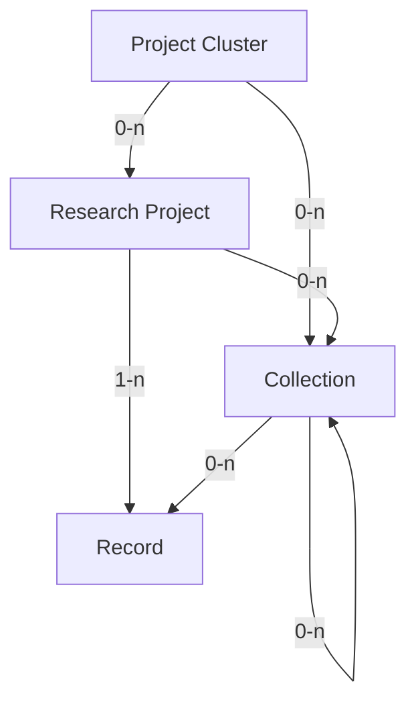

# Metadata Model (v2)

This is the metadata model that the DPE serves. It describes DaSCH research
projects and their context as a hierarchy of entities. The model originated in
the now-retired `dsp-meta` repository, where it was designed as the successor to
the earlier v1 model. The metadata has since been migrated to this repository
and converted to v2; the model is implemented as Rust types in the `dpe-core`
crate (`modules/dpe/core/src/`) and the data lives under
`modules/dpe/server/data/`.

> [!NOTE]
> **Conceptual model vs. implementation.**
> This page documents the *conceptual* v2 model — the full design as it was
> worked out. The implementation in `dpe-core` is a pragmatic subset: some
> entities and fields are not (yet) implemented, and a few differ in shape from
> the design. Each section carries an **As implemented** callout describing the
> current state. Treat the conceptual tables as the design intent and the
> callouts as the source of truth for what the code does today.

The enhancements over v1 are designed to better accommodate the inherent
complexity of humanities projects, while still supporting simpler project
structures. The two main additions are:

- a hierarchical level *above* the research project — the **project cluster** —
  which represents overarching initiatives that span multiple projects over
  long periods;
- **collections**, which allow more precise referencing and grouping of parts of
  the data, including cross-project and nested groupings. Collections replace
  the v1 *dataset* concept.

> [!NOTE]
> For each property, two cardinalities may be given:
>
> - the **archival cardinality**, which applies once the entity is
>   finished/finalized for archival;
> - the **in-progress (WIP) cardinality**, which applies while the entity is
>   still in progress.
>
> If only one cardinality is given, it applies to both stages.

## Licensing

All metadata is considered public domain. By signing the deposit agreement,
projects consent to that. This is unlike the *domain* metadata which is part of
the project's data and can be licensed as the project wishes.

Whenever metadata is served to a client, it is served with legal information.
Legal information on metadata, as everywhere else, consists of the license, the
copyright holder and the authorship. For metadata the license is always "public
domain", the copyright holder is always "DaSCH" and the authorship is always the
project and DaSCH.

Metadata is always publicly available, even if the corresponding project,
collection or record is not. This ensures the metadata stays findable and
reusable even if the data itself is not. The only exception is the status
"embargoed", during which the metadata is *only* available on the project level.

## Model Overview

The metadata model is a hierarchical structure of metadata elements.



- A **Project Cluster** collects research projects (or nested project clusters).
  It is typically institutional in nature, not directly tied to a specific
  funding grant, and may be long-lived. Examples are EKWS/CAS, BEOL or LHTT.
- A **Research Project** is the main entity of the model. It corresponds to a
  `project` in the DSP. It is typically tied to a specific funding grant and
  hence has a limited lifetime of ~3–5 years; multiple funding rounds and a
  longer lifetime are possible. A research project is part of 0–n project
  clusters and contains both collections and records. All records in the project
  are listed in the project's `records` array, regardless of collection
  membership.
- A **Collection** is a flexible grouping of records that can span multiple
  projects or be nested within other collections. Collections enable
  cross-project organization and support subsetting and specialized access
  patterns. They may contain both individual records and nested collections.
- A **Record** is a single entry within a project — the smallest unit that can
  meaningfully have an identifier. It maps to a `knora-base:Resource` (DSP-API)
  or an `Asset` (SIPI/Ingest) in the DSP. For DSP resources, the metadata of the
  record is the existence of the resource itself plus information such as label,
  access rights and provenance; the core data are the values on that resource.
  For assets, the metadata is the existence of the asset and its access rights;
  the core data is the binary content. A record is part of exactly 1 research
  project and may be part of 0–n collections.

Additionally, **Person** and **Organization** are entities independent of the
project hierarchy, related to various entities within it (e.g. as contacts,
contributors or funders).

## Entity Types

### Project Cluster

| Field                   | Type          | Card. |
| ----------------------- | ------------- | ----- |
| `id`                    | internal_id   | 1     |
| `pid`                   | string        | 1     |
| `name`                  | string        | 1     |
| `projects`              | internal_id[] | 0-n   |
| `projectClusters`       | internal_id[] | 0-n   |
| `collections`           | internal_id[] | 0-n   |
| `description`           | lang_string   | 0-1   |
| `url`                   | url           | 0-1   |
| `howToCite`             | string        | 0-1   |
| `alternativeNames`      | lang_string[] | 0-n   |
| `contactPoint`          | internal_id[] | 0-n   |
| `documentationMaterial` | url[]         | 0-n   |

- `id`: A unique internal identifier; not exposed to the user and not persistent.
- `pid`: A unique persistent identifier (currently an ARK URL).
- `name`: The name of the project cluster.
- `projects`: Identifiers of the projects in the cluster.
- `projectClusters`: Identifiers of nested project clusters.
- `description`: The description of the cluster.
- `url`: The URL to the web presence of the cluster.
- `howToCite`: How to cite the cluster. If not provided, the standard form
  `<name> (<year>). [Project Cluster]. DaSCH. <ARK>` is used.
- `alternativeNames`: Alternative names of the cluster.
- `contactPoint`: Persons or organizations responsible for the cluster.
- `documentationMaterial`: URLs pointing to documentation material.

Most fields are optional, to keep the entity flexible. There is no difference in
cardinality between the archival and in-progress stages.

> [!WARNING]
> **As implemented** (`cluster.rs`): a cluster only has `id`, `name`,
> `description` (a `lang_string`) and `projects`; `pid` is parsed but optional.
> The fields `projectClusters` (nested clusters), `collections`, `url`,
> `howToCite`, `alternativeNames`, `contactPoint` and `documentationMaterial`
> are **not implemented**. Within a project, a cluster is exposed as a
> lightweight reference (`id`, `name`, flattened `description`). There are
> currently 5 cluster files.

### Project

| Field                   | Type                                   | Card. | WIP Card. |
| ----------------------- | -------------------------------------- | ----- | --------- |
| `id`                    | internal_id                            | 1     | 1         |
| `pid`                   | string                                 | 1     | 1         |
| `shortcode`             | string                                 | 1     | 1         |
| `officialName`          | string                                 | 1     | 1         |
| `status`                | string                                 | 1     | 1         |
| `name`                  | string                                 | 1     | 1         |
| `shortDescription`      | string                                 | 1     | 0-1       |
| `description`           | lang_string                            | 1     | 1         |
| `startDate`             | date                                   | 1     | 0-1       |
| `endDate`               | date                                   | 1     | 0-1       |
| `dataPublicationYear`   | date                                   | 1     | 0-1       |
| `url`                   | url                                    | 1-2   | 0-2       |
| `howToCite`             | string                                 | 1     | 1         |
| `accessRights`          | accessRights                           | 1     | 1         |
| `legalInfo`             | legalInfo[]                            | 1-n   | 0-n       |
| `dataManagementPlan`    | string / url                           | 1     | 1         |
| `typeOfData`            | string[]                               | 1-n   | 0-n       |
| `dataLanguage`          | lang_string[]                          | 1-n   | 0-n       |
| `collections`           | internal_id[]                          | 0-n   | 0-n       |
| `records`               | internal_id[]                          | 0-n   | 0-n       |
| `keywords`              | lang_string[]                          | 1-n   | 0-n       |
| `disciplines`           | lang_string / authorityFileReference[] | 1-n   | 0-n       |
| `temporalCoverage`      | lang_string / authorityFileReference[] | 1-n   | 0-n       |
| `spatialCoverage`       | authorityFileReference[]               | 1-n   | 0-n       |
| `attributions`          | attribution[]                          | 1-n   | 0-n       |
| `abstract`              | lang_string                            | 0-1   | 0-1       |
| `contactPoint`          | internal_id[]                          | 0-n   | 0-n       |
| `publications`          | publication[]                          | 0-n   | 0-n       |
| `funding`               | string / grant[]                       | 1-n   | 0-n       |
| `alternativeNames`      | lang_string[]                          | 0-n   | 0-n       |
| `documentationMaterial` | url[]                                  | 0-n   | 0-n       |
| `provenance`            | string                                 | 0-1   | 0-1       |
| `additionalMaterial`    | url[]                                  | 0-n   | 0-n       |

- `id`: A unique internal identifier; not exposed to the user and not persistent.
- `pid`: A unique persistent identifier (currently an ARK URL).
- `shortcode`: The project's DSP shortcode, internal only. Four hexadecimal
  characters, upper case.
- `officialName`: The official name of the project.
- `status`: The status of the project — either "Ongoing" or "Finished".
- `name`: The name of the project.
- `shortDescription`: A short teaser. Maximum length: 200 characters.
- `description`: The full description of the project.
- `startDate`: The start date of the project.
- `endDate`: The end date of the project.
- `dataPublicationYear`: The year the data is published — normally the year the
  project finishes and the data moves to the archive. Under embargo, the year
  the embargo is lifted. Projects published while in the VRE may set a specific
  year.
- `url`: The URL(s) to the web presence of the project. The first should point
  to where the data is available; the second, optional, may point to the project
  website.
- `howToCite`: How to cite the project. If not provided, the standard form
  `<contributors> (<year>). <project name> [Database]. DaSCH. <ARK>` is used.
- `accessRights`: The access rights of the project (see [Access Rights](#access-rights)).
  Defines to what extent the project data is accessible in the DPE. If the
  project is embargoed, the metadata is only available on the project level.
- `legalInfo`: Legal information about the project. Calculated from records;
  cannot be specified explicitly on the project.
- `dataManagementPlan`: A data management plan (string or URL); use "not
  accessible" if not available.
- `typeOfData`: The type(s) of data — "XML", "Text", "Image", "Video", "Audio".
  Computed from the records where available and optionally added manually.
- `dataLanguage`: Languages contained in the project. Computed from the records
  where available and optionally added manually.
- `collections`: Collection identifiers that optionally group project data.
- `records`: Identifiers of all records that make up the project data. This is
  the canonical list of *all* records in the project.
- `keywords`: Keywords describing the project.
- `disciplines`: Disciplines the project relates to.
- `temporalCoverage`: Epochs or time periods the project relates to.
- `spatialCoverage`: References to spatial entities (places, regions, …).
- `attributions`: Roles people/organizations have in the project. Entered
  manually, since there may be people without authorship (reviewers, organizers,
  …).
- `abstract`: An abstract of the project.
- `contactPoint`: Persons or organizations responsible for the project.
- `publications`: Publications related to the project.
- `funding`: Either a string ("No funding") or a list of grants.
- `alternativeNames`: Alternative names of the project.
- `documentationMaterial`: URLs pointing to documentation material.
- `provenance`: The history of the project, if applicable.
- `additionalMaterial`: Additional URLs related to the project.

> [!NOTE]
> All records of a project are referenced in its `records` array, regardless of
> collection membership — this is the canonical list.

> [!WARNING]
> **As implemented** (`project.rs`): the project is the most complete entity.
> Notable differences from the conceptual table:
>
> - `url` is parsed into a single primary `url` plus a separate `secondaryUrl`,
>   both [authority file references](#authority-file-reference). The legacy
>   string-array form (`["<data url>", "<website url>"]`) is still accepted: the
>   first element becomes `url`, the second `secondaryUrl`. Placeholder strings
>   (`"MISSING"`, `"CALCULATED"`) are filtered out so they never render as live
>   links.
> - `clusters` and `collections` are stored as ID lists and resolved to
>   lightweight references on demand.
> - Many fields are optional in the code regardless of the archival cardinality
>   above (e.g. `dataManagementPlan`, `dataPublicationYear`, `typeOfData`,
>   `dataLanguage`, `records`, `publications`, `provenance`, `additionalMaterial`).

### Collection

| Field                   | Type          | Card. | WIP Card. |
| ----------------------- | ------------- | ----- | --------- |
| `id`                    | internal_id   | 1     | 1         |
| `pid`                   | string        | 1     | 1         |
| `name`                  | string        | 1     | 1         |
| `accessRights`          | accessRights  | 1     | 1         |
| `legalInfo`             | legalInfo[]   | 1-n   | 1-n       |
| `howToCite`             | string        | 1     | 1         |
| `description`           | lang_string   | 0-1   | 0-1       |
| `typeOfData`            | string[]      | 1-n   | 0-n       |
| `dateCreated`           | date          | 1     | 0-1       |
| `dateModified`          | date          | 0-1   | 0-1       |
| `records`               | internal_id[] | 0-n   | 0-n       |
| `collections`           | internal_id[] | 0-n   | 0-n       |
| `languages`             | lang_string[] | 1-n   | 0-n       |
| `additionalMaterial`    | url[]         | 0-n   | 0-n       |
| `provenance`            | string        | 0-1   | 0-1       |
| `keywords`              | lang_string[] | 0-n   | 0-n       |
| `documentationMaterial` | url[]         | 0-n   | 0-n       |

- `id`: A unique internal identifier; not exposed to the user and not persistent.
- `pid`: A unique persistent identifier (currently an ARK URL).
- `name`: The name of the collection.
- `accessRights`: The access rights of the collection (see [Access Rights](#access-rights)).
- `legalInfo`: Legal information about the collection. Calculated from
  records/sub-collections; may be added manually.
- `howToCite`: How to cite the collection. If not provided, the standard form
  `<contributors> (<year>). <collection name> [Collection]. DaSCH. <ARK>` is used.
- `description`: The description of the collection.
- `typeOfData`: The type(s) of data — "XML", "Text", "Image", "Video", "Audio".
- `dateCreated`: When the collection was created.
- `dateModified`: When the collection was last modified.
- `records`: Identifiers of the records in the collection.
- `collections`: Identifiers of nested collections.
- `languages`: Languages contained in the collection.
- `additionalMaterial`: Additional URLs related to the collection.
- `provenance`: The history of the collection, if applicable.
- `keywords`: Keywords for search purposes.
- `documentationMaterial`: URLs pointing to documentation material.

> [!WARNING]
> **As implemented** (`collection.rs`): only a lightweight reference type exists
> (`id`, `name`, `description`). The full collection entity above is **not
> implemented**, and there are currently **no collection data files** — projects
> reference collections by ID, but no collections are populated. Collections
> remain part of the design but are unused in practice.

### Record

| Field           | Type          | Card. | WIP Card. |
| --------------- | ------------- | ----- | --------- |
| `id`            | internal_id   | 1     | 1         |
| `pid`           | string        | 1     | 1         |
| `label`         | lang_string   | 1     | 1         |
| `accessRights`  | string        | 1     | 1         |
| `legalInfo`     | legalInfo     | 1     | 1         |
| `howToCite`     | string        | 1     | 1         |
| `publisher`     | string        | 1     | 1         |
| `source`        | string        | 0-1   | 0-1       |
| `description`   | lang_string   | 0-1   | 0-1       |
| `dateCreated`   | date          | 0-1   | 0-1       |
| `dateModified`  | date          | 0-1   | 0-1       |
| `datePublished` | date          | 0-1   | 0-1       |
| `typeOfData`    | string        | 0-1   | 0-1       |
| `size`          | string        | 0-1   | 0-1       |
| `keywords`      | lang_string[] | 0-n   | 0-n       |

- `id`: A unique identifier for the record.
- `pid`: A unique persistent identifier (an ARK URL).
- `label`: The label of the record. For assets, this may be the original file
  name. For IIIF URLs, it is useful for the case when the URL is no longer
  available. In the long run IIIF Manifests, rather than image URLs, would let
  labels be extracted from there.
- `accessRights`: The access rights of the record. Defines to what extent the
  record data is accessible in the DPE.
- `legalInfo`: Legal information about the record.
- `howToCite`: How to cite the record. If not provided, the standard form
  `<label> (<creation year>). [Data Record]. DaSCH. <ARK>` is used.
- `publisher`: The publisher of the record. Literal "DaSCH"; required for
  OpenAIRE compliance.
- `source`: The provenance of the record. Recommended for
  [OpenAIRE](https://guidelines.openaire.eu/en/latest/literature/field_source.html):
  use only if the record is a digitization of a non-digital source, in which
  case it should identify the original source.
- `description`: The description of the record. If the project does not want
  descriptions to be public domain and always open, it must not use this
  property but instead create a custom property.
- `dateCreated`, `dateModified`: Creation and modification dates.
- `datePublished`: When the record was made publicly available — normally when
  it moved to the archive, or when an embargo is lifted.
- `typeOfData`: The type of data — "XML", "Text", "Image", "Video", "Audio".
- `size`: The size of the record
  ([OpenAIRE Size](https://openaire-guidelines-for-literature-repository-managers.readthedocs.io/en/v4.0.0/field_size.html#dci-size)).
- `keywords`: Keywords for search purposes.

> [!WARNING]
> **As implemented** (`record.rs`): records are implemented and the fields match
> the table closely. The `pid` is parsed into its ARK components (host,
> shortcode, record id). Note that record-level metadata — which the original
> design flagged as not yet feasible — *is* now implemented. Coverage is still
> partial: only a few projects currently have record files. Records are exposed
> through the [OAI-PMH endpoint](./oai-pmh.md).

### Person

| Field            | Type                     | Card. |
| ---------------- | ------------------------ | ----- |
| `id`             | internal_id              | 1     |
| `pid`            | string                   | 1     |
| `sameAs`         | authorityFileReference[] | 0-n   |
| `givenNames`     | string[]                 | 1-n   |
| `familyNames`    | string[]                 | 1-n   |
| `honoraryPrefix` | string[]                 | 0-n   |
| `honorarySuffix` | string[]                 | 0-n   |
| `affiliations`   | internal_id[]            | 0-n   |
| `email`          | string                   | 0-n   |
| `address`        | address                  | 0-1   |

Cardinality is the same for both stages.

- `id`: A unique internal identifier; not exposed to the user and not persistent.
- `pid`: A unique persistent identifier (currently an ARK URL).
- `sameAs`: References to external authority files (ORCID, VIAF, GND, …).
- `givenNames`: The given names of the person.
- `familyNames`: The family names of the person.
- `honoraryPrefix`: Honorary prefixes, e.g. "Prof. Dr.".
- `honorarySuffix`: Honorary suffixes, e.g. "PhD", "MA".
- `affiliations`: Organizations the person is affiliated with.
- `email`: The email address of the person.
- `address`: The postal address of the person — the address at their
  organization, not a personal address.

> [!WARNING]
> **As implemented** (`person.rs`): the person has `id`, `givenNames`,
> `familyNames`, `jobTitles` (`string[]`), `affiliations`, `sameAs` and `email`.
> Differences from the conceptual table: there is **no** `pid`,
> `honoraryPrefix`, `honorarySuffix` or `address`, and there is an **additional**
> `jobTitles` field not in the original design. Note that project-contribution
> *roles* (e.g. "Project leader") belong in a project's `attributions`, not in
> `jobTitles` — a guard enforces this for an explicit list of role words.

### Organization

| Field             | Type                     | Card. |
| ----------------- | ------------------------ | ----- |
| `id`              | internal_id              | 1     |
| `pid`             | string                   | 1     |
| `sameAs`          | authorityFileReference[] | 0-n   |
| `name`            | string                   | 1     |
| `url`             | url                      | 1     |
| `address`         | address                  | 0-1   |
| `email`           | string                   | 0-1   |
| `alternativeName` | lang_string              | 0-1   |

Cardinality is the same for both stages.

- `id`: A unique internal identifier; not exposed to the user and not persistent.
- `pid`: A unique persistent identifier (currently an ARK URL).
- `sameAs`: References to external authority files (e.g. [ROR](https://ror.org/)).
- `name`: The name of the organization.
- `url`: The URL of the organization.
- `address`: The address of the organization.
- `email`: The email address of the organization.
- `alternativeName`: Alternative names of the organization.

> [!WARNING]
> **As implemented** (`organization.rs`): matches the table except there is
> **no** `pid`.

## Value Types

### String with Language Tag (`lang_string`)

An object with ISO language codes as keys and strings as values:

```json
{
  "en": "Lorem ipsum in English.",
  "de": "Lorem ipsum auf Deutsch."
}
```

A single `lang_string` value can hold multiple translations.

### Authority File Reference

An object representing a reference to an external authority file.

| Field  | Type   | Card. |
| ------ | ------ | ----- |
| `type` | string | 1     |
| `url`  | url    | 1     |
| `text` | string | 0-1   |

- `type`: The type of the reference — e.g. 'Geonames', 'Pleiades', 'Skos',
  'Periodo', 'Chronontology', 'GND', 'VIAF', 'Grid', 'ORCID', 'Creative
  Commons', 'COAR'. Used to determine the semantics of the URL. The
  implementation also uses `'URL'` for plain links.
- `url`: The URL itself.
- `text`: A human-readable text for display.

### PID

A persistent identifier — may be an ARK or a DOI. Used e.g. on publications.

| Field  | Type   | Card. |
| ------ | ------ | ----- |
| `url`  | url    | 1     |
| `text` | string | 0-1   |

### Publication

| Field  | Type   | Card. |
| ------ | ------ | ----- |
| `text` | string | 1     |
| `pid`  | pid    | 0-1   |

- `text`: The text of the publication.
- `pid`: A URL to the publication, e.g. a DOI, if available.

### Address

| Field        | Type   | Card. |
| ------------ | ------ | ----- |
| `street`     | string | 1     |
| `postalCode` | string | 1     |
| `locality`   | string | 1     |
| `country`    | string | 1     |
| `canton`     | string | 0-1   |
| `additional` | string | 0-1   |

### Grant

| Field     | Type          | Card. | Restrictions               |
| --------- | ------------- | ----- | -------------------------- |
| `funders` | internal_id[] | 1-n   | Person or Organization IDs |
| `number`  | string        | 0-1   |                            |
| `name`    | string        | 0-1   |                            |
| `url`     | url           | 0-1   |                            |

### Legal Info

| Field             | Type     | Card. |
| ----------------- | -------- | ----- |
| `license`         | license  | 1     |
| `copyrightHolder` | string   | 1     |
| `authorship`      | string[] | 1-n   |

### License

| Field               | Type   | Card. |
| ------------------- | ------ | ----- |
| `licenseIdentifier` | string | 1     |
| `licenseDate`       | date   | 1     |
| `licenseURI`        | url    | 1     |

### Attribution

Modelled according to the
[OpenAIRE guidelines](https://guidelines.openaire.eu/en/latest/data/field_contributor.html).

| Field             | Type        | Card. |
| ----------------- | ----------- | ----- |
| `contributor`     | internal_id | 1     |
| `contributorType` | string[]    | 1-n   |

### Access Rights

| Field          | Type   | Card. |
| -------------- | ------ | ----- |
| `accessRights` | string | 1     |
| `embargoDate`  | date   | 0-1   |

- `accessRights`: One of "Full Open Access", "Open Access with Restrictions",
  "Embargoed Access", "Metadata only Access".
- `embargoDate`: The date when the embargo ends.

> [!WARNING]
> **As implemented**: `accessRights` is one of the four literals above (the
> conceptual design referred to a COAR authority-file reference). The value is
> wrapped in an object, e.g. `{ "accessRights": "Full Open Access" }`, with an
> optional `embargoDate`.

### Internal ID

An internal ID (`internal_id`) is a unique identifier for an entity within the
system. It is not intentionally exposed to the user and is presented as a string.

## OpenAIRE Mapping

The model includes a mapping to the OpenAIRE Guidelines for Data Archives, which
are based on the DataCite Metadata Schema. Currently only projects are exposed as
OpenAIRE datasets. For the endpoint that serves this, see the
[OAI-PMH Endpoint](./oai-pmh.md) page.

The OpenAIRE Guidelines specify 18 fields, with cardinalities Mandatory (M),
Recommended (R), Mandatory if Applicable (MA) and Optional (O):

1. Identifier (M)
2. Creator (M)
3. Title (M)
4. Publisher (M)
5. PublicationYear (M)
6. Subject (R)
7. Contributor (MA/O)
8. Date (M)
9. Language (R)
10. ResourceType (R)
11. AlternateIdentifier (O)
12. RelatedIdentifier (MA)
13. Size (O)
14. Format (O)
15. Version (O)
16. Rights (MA)
17. Description (MA)
18. GeoLocation (O)

### Project → OpenAIRE Dataset Mapping

| Project Field                      | OpenAIRE Field              | Mapping Notes                                  |
| ---------------------------------- | --------------------------- | ---------------------------------------------- |
| `pid`                              | **Identifier (M)**          | Direct mapping                                 |
| `attributions` (creator roles)     | **Creator (M)**             | Which roles count as creators is project-specific |
| `name`                             | **Title (M)**               | Direct mapping                                 |
| Fixed "DaSCH"                       | **Publisher (M)**           | Static value                                   |
| TBD date field                     | **PublicationYear (M)**     | `startDate` or `endDate` year — project-specific |
| `keywords`                         | **Subject (R)**             | Direct mapping                                 |
| `attributions` (non-creator roles) | **Contributor (MA/O)**      | Remaining attributions                         |
| `startDate`, `endDate`             | **Date (M)**                | Multiple dates                                 |
| Computed from records              | **Language (R)**            | Aggregated from project records                |
| Fixed "Dataset"                     | **ResourceType (R)**        | Static value for projects                      |
| `shortcode`                        | **AlternateIdentifier (O)** | DSP shortcode as alternate ID                  |
| `collections` refs                 | **RelatedIdentifier (MA)**  | Collection relationships                       |
| Computed from records              | **Size (O)**                | Aggregated from project records                |
| Computed from records              | **Format (O)**              | Aggregated `typeOfData` from records           |
| Not applicable                     | **Version (O)**             | Projects don't have versions                   |
| `legalInfo`                        | **Rights (MA)**             | Direct mapping                                 |
| `description`                      | **Description (MA)**        | Direct mapping                                 |
| `spatialCoverage`                  | **GeoLocation (O)**         | Direct mapping                                 |

Open questions in the design include which attribution roles map to Creator vs.
Contributor, how PublicationYear should be derived per project, and whether
collections should also be exposed as OpenAIRE datasets.

## Examples

The following examples show the conceptual JSON shape. Real data files live under
`modules/dpe/server/data/` and may differ in the ways noted in the **As
implemented** callouts above (e.g. the legacy `url` array form).

### Project Cluster

```json
{
  "id": "cluster-0001",
  "pid": "https://ark.dasch.swiss/ark:/72163/1/cluster-0001",
  "name": "Project Cluster Name",
  "projects": ["project-0001", "project-0002"],
  "projectClusters": ["cluster-0002"],
  "description": {
    "en": "Project Cluster Description",
    "de": "Projektcluster Beschreibung"
  },
  "url": "https://example.com/project-cluster",
  "howToCite": "Project Cluster Name (2025). [Project Cluster]. DaSCH. https://ark.dasch.swiss/ark:/72163/1/cluster-0001",
  "alternativeNames": [{ "en": "Alternative Name", "de": "Alternativer Name" }],
  "contactPoint": ["person-0001", "organization-0001"],
  "documentationMaterial": ["https://example.com/documentation"]
}
```

### Project

```json
{
  "id": "project-0001",
  "pid": "https://ark.dasch.swiss/ark:/72163/1/project-0001",
  "shortcode": "1234",
  "officialName": "Project Official Name",
  "status": "Ongoing",
  "name": "Project Name",
  "shortDescription": "Short description of the project.",
  "description": { "en": "Project Description", "de": "Projektbeschreibung" },
  "startDate": "2023-01-01",
  "endDate": "2028-01-01",
  "url": { "type": "URL", "url": "https://data.dasch.swiss/projects/project-0001" },
  "secondaryUrl": { "type": "URL", "url": "https://example.com/project-website" },
  "howToCite": "Project Name (2025). [Project]. DaSCH. https://ark.dasch.swiss/ark:/72163/1/project-0001",
  "accessRights": { "accessRights": "Full Open Access" },
  "legalInfo": [
    {
      "license": {
        "licenseIdentifier": "CC BY 4.0",
        "licenseDate": "2023-01-01",
        "licenseURI": "https://creativecommons.org/licenses/by/4.0/"
      },
      "copyrightHolder": "DaSCH",
      "authorship": ["Project XYZ"]
    }
  ],
  "dataManagementPlan": "https://example.com/dmp",
  "collections": ["collection-0001"],
  "records": ["record-0001", "record-0002"],
  "keywords": [{ "en": "Keyword 1", "de": "Stichwort 1" }],
  "disciplines": [{ "en": "Discipline 1", "de": "Disziplin 1" }],
  "temporalCoverage": [{ "en": "2006-2016", "de": "2006-2016" }],
  "spatialCoverage": [
    { "type": "Geonames", "url": "https://www.geonames.org/2658434/", "text": "Switzerland" }
  ],
  "attributions": [
    { "contributor": "person-0001", "contributorType": ["Project leader", "Data curator"] }
  ],
  "abstract": { "en": "Project Abstract", "de": "Projektzusammenfassung" },
  "contactPoint": ["person-0001", "organization-0001"],
  "publications": [{ "text": "Publication Title", "pid": { "url": "https://doi.org/10.1234/5678" } }],
  "funding": [
    { "funders": ["organization-0001"], "number": "123456", "name": "Grant Name", "url": "https://example.com/grant" }
  ],
  "alternativeNames": [{ "en": "Alternative Name", "de": "Alternativer Name" }]
}
```

### Person

```json
{
  "id": "person-0001",
  "givenNames": ["Jane"],
  "familyNames": ["Doe"],
  "jobTitles": ["Senior lecturer"],
  "affiliations": ["organization-0001"],
  "sameAs": [{ "type": "ORCID", "url": "https://orcid.org/0000-0000-0000-0000" }],
  "email": "jane.doe@example.org"
}
```

### Organization

```json
{
  "id": "organization-0001",
  "name": "Université de Lausanne",
  "url": "https://www.unil.ch/",
  "address": {
    "street": "Unicentre",
    "postalCode": "1015",
    "locality": "Lausanne",
    "country": "Switzerland"
  }
}
```
