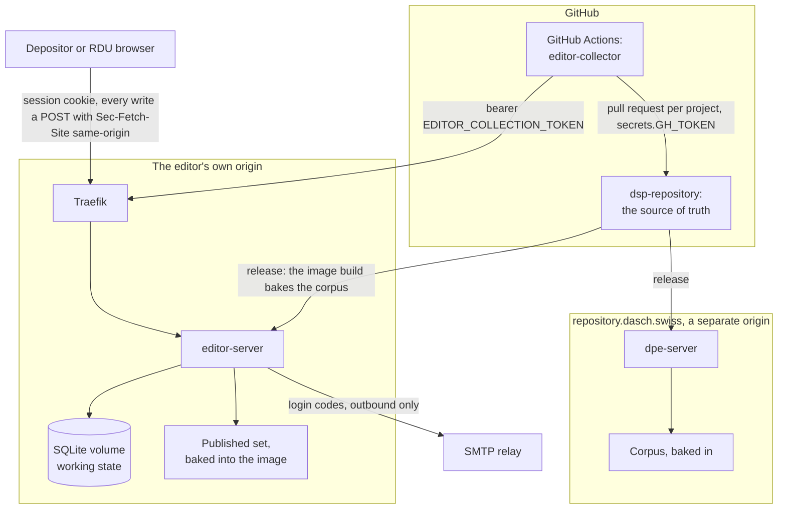

# Editor Architecture

The metadata editor is the Deposit Area's first capability (ADR-0002, ADR-0003): the surface where a depositing project team edits its project metadata, RDU reviews it field by field, and an approved record is carried back into this repository as a pull request. Git stays the source of truth and the editor's database is working state (`areas/deposit/ADR-0001`).

This page describes the architecture **as implemented**. The target the Deposit Area is refactored towards lives only in its decision records, `areas/deposit/docs/adr/`, and the gaps between the two are listed at the end, under [Divergence from the target architecture](#divergence-from-the-target-architecture). Subsystem detail is on the topic pages each section links to.

## The flow, end to end

```mermaid
flowchart LR
  D[Depositor] -->|edits, section by section| Draft
  Draft -->|submit| Sub[Submission]
  Sub -->|RDU decides each changed field| Round[Review round]
  Round -->|approve, one transaction| AR[Approved record]
  AR -->|GET /api/v1/approved-records| C[editor-collector<br/>in GitHub Actions]
  C -->|one pull request per project| PR[Pull request on<br/>this repository]
  C -->|POST /api/v1/collection-report| AR
  PR -->|CI checks, human merge, release| Corpus[Published project files]
  Corpus -->|baked into the image| DPE
  Corpus -->|baked into the image| E[editor, next deployment]
  E -->|reconcile at startup| Online
```

- A **Draft** is the depositor's working copy: the project's JSON members verbatim, one per project, last write wins ([The Project Representation](./project-representation.md), `areas/deposit/ADR-0002`).
- A **Submission** is the draft as submitted, at most one per project. RDU claims it, decides each changed field, substitutes values beside the payload rather than over it, and ends the round with approve, request changes or reject; the depositor can withdraw ([The Review Surface](./review.md)).
- Approve writes the **Approved record**, the submitted draft with every decision applied, deletes the submission and appends the **Review round**, all in one transaction. The record waits to be collected.
- The **collector** runs in GitHub Actions, never in the service. It reads every approved record over the editor's API, writes each project's onto an `editor-collect/<shortcode>` branch, opens or updates one pull request per project, and reports the outcome back ([Collection](./collection.md)). The pull request, its CI checks and a human merge are the gate between the editor and anything served.
- **Online** is never stored. The merged file is baked into the next editor image, and the editor compares its records with that published set once at startup: a record whose data is published is discarded, and the project reads Online ([Project State and Online Detection](./status.md), `areas/deposit/ADR-0003`).

## Components and crates

| Crate | Folder | Role |
|-------|--------|------|
| `editor-core` | `areas/deposit/editor/core` | The domain: the draft, the review diff, project state, the canonical project and entity writers, the published set, and one repository port per aggregate (no Axum, Maud or database dependency) |
| `editor-web` | `areas/deposit/editor/web` | Maud views: the document shell, pages, the form's field registry and widgets |
| `editor-server` | `areas/deposit/editor/server` | The binary: configuration, observability, routing, every handler, the SQLite implementations of the ports, the startup reconcile, mail |
| `editor-collector` | `areas/deposit/editor/collector` | The CI binary that turns approved records into pull requests ([Collection](./collection.md)) |

Dependency direction is `server → web → core`; `editor-collector` sits outside that chain, depending on `editor-core` alone and running as a batch job rather than serving a request. `editor-web` depends on `editor-core` for the project representation it renders, and on `mosaic-tiles`. Component CSS is collected from the Tailwind entry's `@source` globs rather than from the crate graph, so it ships independently of that dependency ([Rendering](./rendering.md)).

Unlike DPE, the **HTML document shell lives in the view crate** (`editor-web/src/view.rs`), not the server crate: the server is a composition root for routing, auth and persistence, and a document shell is a view concern like any other partial. `editor-server/src/shell.rs` turns it into a response and owns the 403 and 404 pages.

Inside `editor-server`, `router.rs` assembles the routes and owns the layer order ([Routing](./routing.md)); the handlers are one module per surface (`sections`, `review`, `entities`, `projects`, `depositors`, `collection`, `auth/`); `db/` implements the nine repository ports against SQLite ([Persistence](./persistence.md)); `reconcile` runs the startup comparison; `mail` sends login codes.

Outside the area the editor depends on `shared-metadata` (the research-metadata contract), `shared-telemetry` (the browser beacon) and `mosaic-tiles`, and on nothing else in the workspace. It never depends on a `dpe-*` crate: DPE's corpus is consumed as data, an image-baked snapshot handed over as `EDITOR_DATA_DIR`, never as code (ADR-0002).

## Deployment topology and trust boundaries

Five boundaries, and what holds each:

- **Browser to editor.** A session comes from a one-time login code sent by mail; there are no passwords. Every state-changing route is `POST` and passes the `Sec-Fetch-Site: same-origin` check, applied as the outermost layer so no route escapes it. Access is two extractors, `Authenticated` and `Rdu`, not a middleware: a handler that names neither is public in its signature ([Authentication](./authentication.md), [Routing](./routing.md)).
- **Editor to DPE.** Separate deployables on separate origins; see [Relationship to DPE](#relationship-to-dpe).
- **CI to editor.** The collector authenticates to the editor with a bearer token the editor verifies (`EDITOR_COLLECTION_TOKEN`). The editor holds no GitHub credential in either direction and makes no outbound GitHub call ([Collection](./collection.md)).
- **Editor to repository.** Only through the pull request the collector opens. The collector writes a disposable checkout on its own `editor-collect/<shortcode>` branch, never in place, and refuses to force-push over a tip it did not write. The pull request is opened with `secrets.GH_TOKEN` so the repository's checks run on it.
- **Editor to the relay.** Outbound only, and no address ever reaches a log ([Authentication](./authentication.md#mail)).

### Relationship to DPE

The editor is a **separate service** from DPE, not a section of it. They share `shared-telemetry` for the browser-beacon contract, `shared-metadata` for the research-metadata contract and `mosaic-tiles` for components — but not a process, an image, or an origin.

The separation is deliberate:

- DPE is public, unauthenticated and read-only. The editor is authenticated and writes state. A host-level compromise of one should not hand over the other's session cookies.
- The editor's CSRF defence requires `Sec-Fetch-Site: same-origin` on every state-changing request. On a shared origin, a request originating from DPE *is* same-origin — so any XSS in DPE, which has a far larger unauthenticated attack surface, could drive authenticated editor mutations. A `Path` on a cookie is not a security boundary and does not close this.

ADR-0002 records the same choice at the platform level: one modulith per area, never one binary for the whole platform.

## Persistence, in one paragraph

One SQLite database on a volume, `rusqlite` bundled into the static binary. `editor-core` owns the records and one repository trait per aggregate; `editor-server/src/db/` implements all nine, so handlers depend on the ports and not on the driver. A writer pool of exactly one connection and a reader pool of several make the single-writer rule structural: readers are `query_only`, and the only write path opens `BEGIN IMMEDIATE`. Every multi-table transition is one repository method in one transaction. Nothing in the database is irreplaceable ([Persistence](./persistence.md), [Operations](./operations.md#backups)).

## Rendering and requests, in one paragraph

Server-rendered HTML with Maud, served by Axum, Datastar for enhancement on top of forms that work without it (ADR-0004). Paths are root-mounted on the editor's own hostname. Every write shares its URL with the `GET` that renders its form and answers two ways, a redirect on the plain path and the changed region as `text/html` on the enhanced one. Two layers wrap the app, CSRF outermost and OTel inside it, and `/healthz` and the telemetry beacon are declared after the OTel layers on purpose, so they stay untraced ([Routing](./routing.md), [Rendering](./rendering.md), [Observability](./observability.md)).

## Decisions

- Platform: the areas and the origin split (ADR-0002), one modulith per area with capabilities behind consumer-defined ports (ADR-0003, amended 2026-09-25 for authentication ports, the area shell and the crate-graph gate), hypermedia surfaces (ADR-0004), where decision records live (ADR-0006).
- The editor's own: git as the source of truth (`areas/deposit/ADR-0001`), the draft as the project's JSON members (`areas/deposit/ADR-0002`), Online derived at startup (`areas/deposit/ADR-0003`), and the target shape of the area (`areas/deposit/ADR-0004`).

## Divergence from the target architecture

`areas/deposit/ADR-0004` decides the target; the code has not reached it. Each entry names what differs, the clause it violates, and where in the code. A refactor step (DEV-7375) removes the entries it closes; the list is empty when the code matches the record.

| # | What differs | Violates | Where in the code |
|---|---|---|---|
| 1 | The composition root is inside the capability: `editor-server` at `areas/deposit/editor/server`, not `deposit-server` at `areas/deposit/server` | `areas/deposit/ADR-0004`, "The shape"; ADR-0002 (the root moves up with the second capability) | `areas/deposit/editor/server/src/{main,serve,cli,config,observability}.rs` |
| 2 | Identity lives inside the editor's crates: accounts, sessions, login codes, mail sends and the depositor list have no `identity-*` crate | `areas/deposit/ADR-0004`, "The shape" | `editor-core/src/records.rs` (`User`, `Session`, `LoginCode`), `editor-core/src/repository.rs` (`UserRepository`, `SessionRepository`, `LoginCodeRepository`, `MailSendRepository`), `editor-server/src/{auth/,accounts,depositors,mail}.rs`, `editor-server/src/db/{users,sessions,login_codes,mail_sends}.rs` |
| 3 | Handlers and routes live in the server crate, not in the capability's web crate | ADR-0003 ("a web crate of views and routes"); `areas/deposit/ADR-0004`, "The shape" | `editor-server/src/{router,sections,review,entities,projects,collection,depositors}.rs`, `editor-server/src/auth/handlers.rs` |
| 4 | The SQLite implementations live in the server crate, not in an `editor-store` crate | ADR-0003 (the `store` crate); `areas/deposit/ADR-0004`, "The shape" | `editor-server/src/db/` |
| 5 | One database file holds identity's and the editor's tables, with seven foreign keys into `users` | ADR-0003 (data sovereignty); `areas/deposit/ADR-0004`, "Two databases" | `editor-server/src/db/migrations/0001_initial.sql`: `drafts.updated_by`, `submissions.submitted_by` and `reviewed_by`, `review_rounds.actor`, `approved_records.approved_by`, `entity_proposals.proposed_by` and `decided_by` |
| 6 | `Authenticated` and `Rdu` read the session and user repositories directly, and the review queue and the concurrent-save notice read user names the same way; no `editor-ports` crate exists | `areas/deposit/ADR-0004`, "What crosses the boundary"; ADR-0003, amendment of 2026-09-25 | `editor-server/src/auth/guard.rs`, `editor-server/src/review.rs` (`UserRepository::list`), `editor-server/src/sections.rs` (`find_by_id`) |
| 7 | The document shell is the editor's, in `editor-web` and `editor-server`, not the area's `deposit-shell` | `areas/deposit/ADR-0004`, "The shape"; ADR-0003, amendment of 2026-09-25 | `editor-web/src/view.rs`, `editor-web/src/components/global/`, `editor-server/src/shell.rs` |
| 8 | No crate-graph gate exists; the capability boundary holds by review | ADR-0003, amendment of 2026-09-25; `areas/deposit/ADR-0004`, "Enforced by" | `.github/scripts/check-capability-deps.sh` (absent), `justfile` (`check`) |
